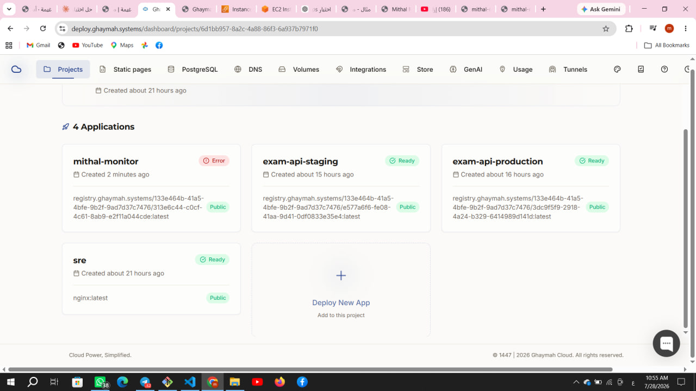
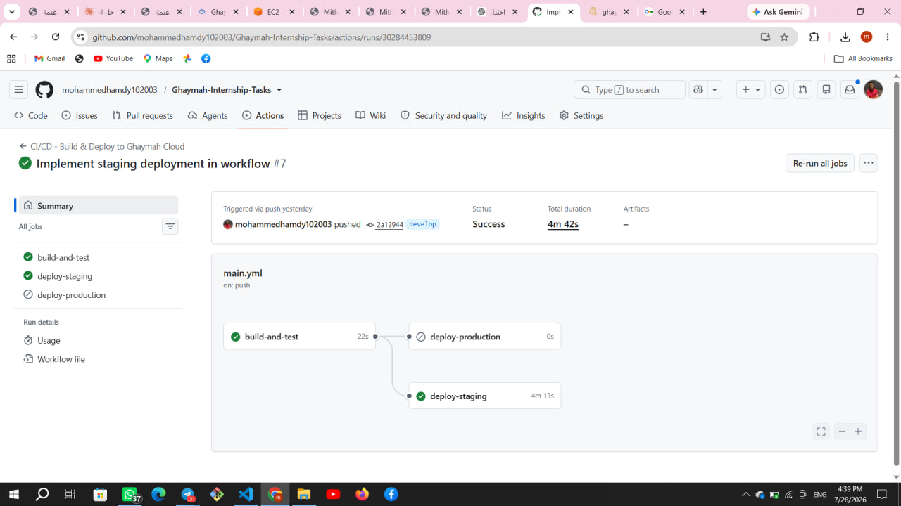
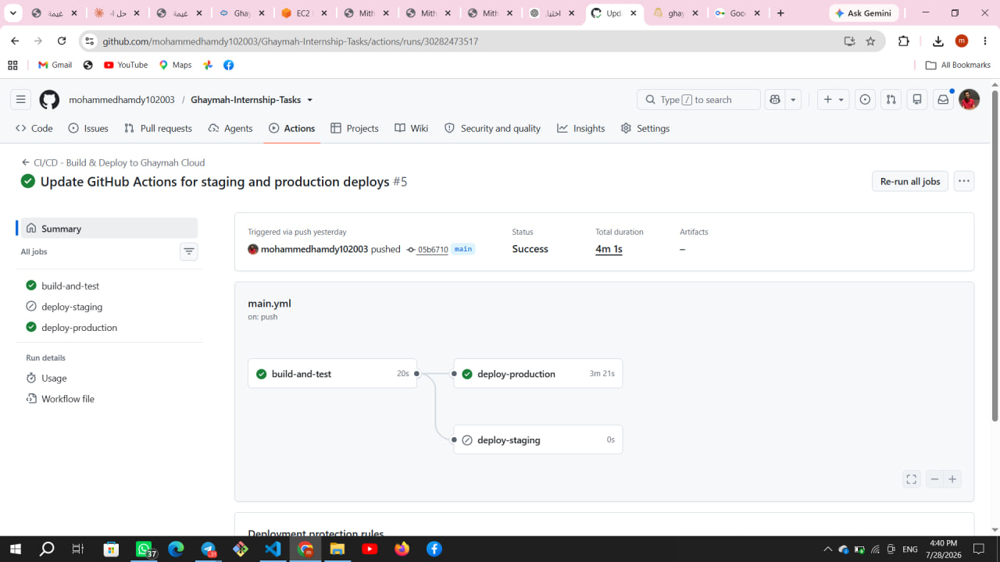
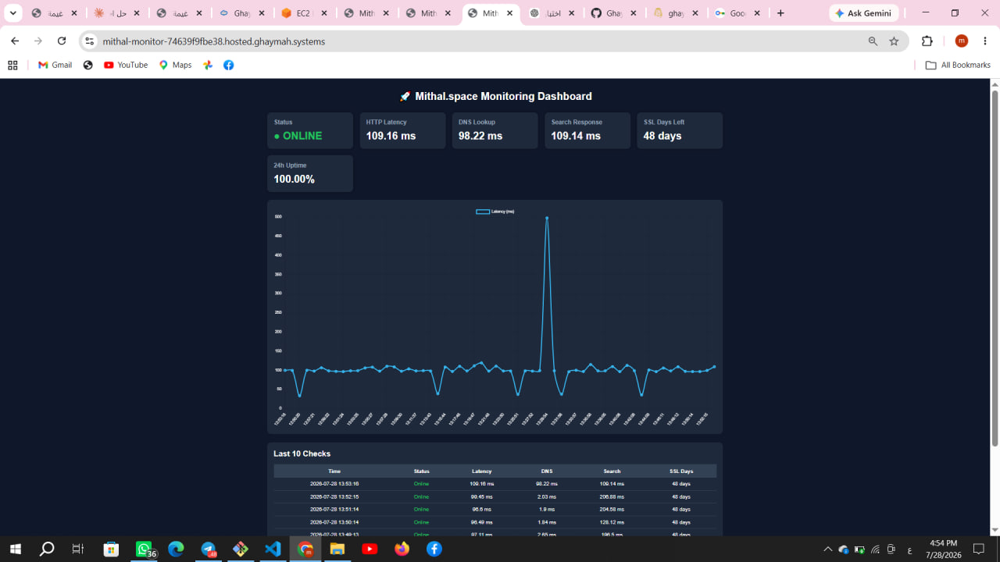

# Ghaymah SRE / DevOps Technical Assessment

This repository contains my complete submission for the **Ghaymah SRE / DevOps Technical Assessment**, including all required tasks and bonus challenges.

The project is organized into five independent tasks covering deployment, monitoring, incident analysis, CI/CD, scalability, cloud deployment, and the bonus integration tasks.

---

# Repository Structure

```text
.
├── .github/
│   └── workflows/
│       └── main.yml
├── q1-deploy-monitor/
├── q2-postmortem/
├── q3-cicd/
├── q4-scalability/
├── q5-mithal-monitor/
├── common-mortakaz/
└── common-qabilah/
```

The GitHub Actions workflow used for the CI/CD pipeline is located in:

```text
.github/workflows/main.yml
```

---

# Tasks

## ✅ Q1 – Deploy & Monitoring

Deploy a production-ready monitoring application with health checks and monitoring endpoints.

### Features

- Dockerized application
- Monitoring service
- Health endpoint
- Metrics endpoint
- Deployment configuration

📂 Folder

```text
q1-deploy-monitor/
```

For implementation details, see the README inside the task folder.

🌐 Live Demo

Application

> https://sre-2be55e4567b8.hosted.ghaymah.systems

Health Check

> https://sre-2be55e4567b8.hosted.ghaymah.systems/health

Metrics

> https://sre-2be55e4567b8.hosted.ghaymah.systems/api/metrics

---

## ✅ Q2 – Incident Postmortem

Root cause analysis and postmortem report for the production incident.

### Includes

- Timeline
- Root Cause Analysis
- Impact Assessment
- Corrective Actions
- Preventive Actions

📂 Folder

```text
q2-postmortem/
```

For implementation details, see the README inside the task folder.

---

## ✅ Q3 – CI/CD Pipeline

Implemented a complete CI/CD workflow that automatically builds and deploys the application.

### Features

- GitHub Actions
- Docker Build
- Smoke Testing
- Automatic Staging Deployment
- Manual Approval before Production
- Production Deployment using Ghaymah CLI

📂 Folder

```text
q3-cicd/
```

Workflow Location

```text
.github/workflows/main.yml
```

### CI/CD Pipeline



### GitHub Actions Results

| Staging Pipeline | Production Pipeline |
|-----------------|---------------------|
|  |  |

For implementation details, see the README inside the task folder.

🌐 Live Demo

Production

> https://exam-api-production-f87c48f822aa.hosted.ghaymah.systems

---

## ✅ Q4 – Scalability

Scalability proposal and production architecture improvements.

### Includes

- Bottleneck Analysis
- Scaling Strategy
- High Availability
- Load Balancing
- Database Improvements
- Monitoring Recommendations

📂 Folder

```text
q4-scalability/
```

For implementation details, see the README inside the task folder.

---

## ✅ Q5 – Mithal Monitor Deployment

Deploy the monitoring service on Ghaymah Cloud.

### Features

- Docker Deployment
- Public HTTPS Endpoint
- Health Monitoring
- Metrics Collection
- Real-Time Monitoring Dashboard

📂 Folder

```text
q5-mithal-monitor/
```

### Dashboard



For implementation details, see the README inside the task folder.

🌐 Live Demo

Application

> https://mithal-monitor-74639f9fbe38.hosted.ghaymah.systems

Health Check

> https://mithal-monitor-74639f9fbe38.hosted.ghaymah.systems/health

Metrics

> https://mithal-monitor-74639f9fbe38.hosted.ghaymah.systems/api/metrics

---

# ⭐ Bonus Tasks

## Common – Mortakaz Integration Proposal

This section contains two integration proposals for products available on **Mortakaz**.

### Includes

- Green Framework Integration Proposal
- Jadl Integration Proposal

📂 Folder

```text
common-mortakaz/
```

---

## Common – Qabilah Profile

My Qabilah profile created for the assessment.

📂 Folder

```text
common-qabilah/
```

Profile

> https://qabilah.com/profile/mohammedhamdy102003/posts

---

# Technologies Used

- Docker
- Python
- Flask
- GitHub Actions
- Ghaymah Cloud
- Ghaymah CLI
- GitHub Environments
- GitHub Secrets
- Gunicorn
- Linux
- Bash
- Git
- GitHub
- GitPasha
- Markdown

---

# Author

**Mohammed Hamdy**

Faculty of Engineering, Sohag University

DevOps / SRE Enthusiast

GitHub

> https://github.com/mohammedhamdy102003/Ghaymah-Internship-Tasks

GitPasha

> https://app.gitpasha.com/mohammedhamdy/ghaymah-exam-mohammedhamdy-sre
