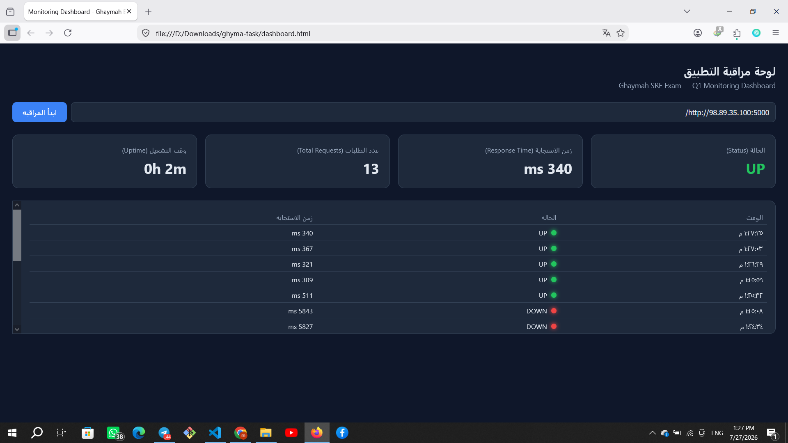
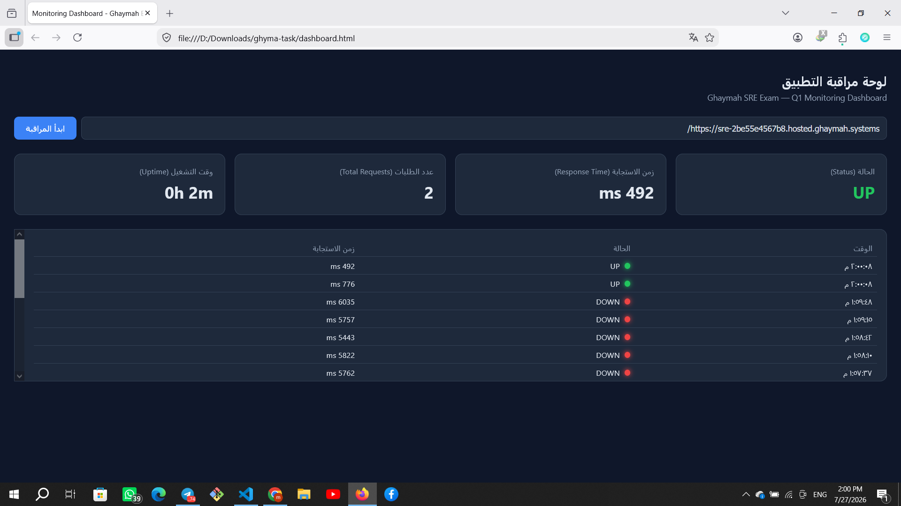

# Q1 - Deploy and Monitor an API on Ghaymah Cloud

## Overview

This project demonstrates deploying a Dockerized Python API to **Ghaymah Cloud** and implementing a simple monitoring solution.

The application exposes a `/health` endpoint that is continuously monitored using a Python script. A lightweight HTML dashboard displays the application's health status, response time, uptime, and request statistics.

---

# Project Structure

```
Q1-Deploy-and-Monitoring/
│
├── screenshots/
│   ├── dashboard-local.png
│   └── dashboard-ghaymah.png
│
├── Dockerfile
├── app.py
├── health-check.py
├── dashboard.html
├── monitor-log.csv
├── requirements.txt
├── install-docker.sh
└── README.md
```

---

# Task Requirements

This implementation satisfies all requirements of Question 1.

| Requirement | Status |
|------------|--------|
| Dockerize the API | ✅ |
| Deploy to Ghaymah Cloud | ✅ |
| Implement `/health` endpoint | ✅ |
| Monitoring script (every 30 seconds) | ✅ |
| Monitoring Dashboard | ✅ |

---

# Technologies

- Python
- Flask
- Docker
- HTML
- CSS
- JavaScript
- Ghaymah Cloud
- Ghaymah CLI

---

# API

## Health Endpoint

```
GET /health
```

Example response

```json
{
    "status": "healthy"
}
```

The monitoring script periodically sends requests to this endpoint to verify application availability.

---

# Docker

Build the Docker image

```bash
docker build -t exam-api .
```

Run the container

```bash
docker run -d -p 5000:5000 exam-api
```

---

# Monitoring Script

The monitoring script (`health-check.py`) executes every **30 seconds** and performs the following operations:

- Sends an HTTP request to `/health`
- Measures response latency
- Detects application availability
- Records monitoring results
- Updates `monitor-log.csv`

Run the monitor

```bash
python3 health-check.py
```

---

# Monitoring Dashboard

The dashboard was implemented using HTML, CSS and JavaScript.

Displayed metrics include:

- Current application status
- Response time
- Total requests
- Application uptime
- Monitoring history

---

# Deployment using Ghaymah CLI

The application was deployed to **Ghaymah Cloud** using the official CLI.

Deployment workflow:

1. Install Ghaymah CLI
2. Authenticate using account credentials
3. Select deployment configuration
4. Launch the application

Example commands

```bash
gy auth login

cp .ghaymah.production.json .ghaymah.json

gy resource app launch
```

---

# Dashboard Preview

## Local Testing

The dashboard was first tested locally against the application running on the EC2 instance before deploying to Ghaymah Cloud.



---

## Ghaymah Cloud Deployment

After deployment, the dashboard successfully monitored the live application hosted on **Ghaymah Cloud**.



---

# Result

The project successfully demonstrates:

- Docker containerization
- Cloud deployment on Ghaymah
- Automated health monitoring
- Response time tracking
- Monitoring dashboard
- Continuous application health verification

This implementation satisfies all requirements of **Question 1 – Deploy and Monitor an API on Ghaymah Cloud**.
